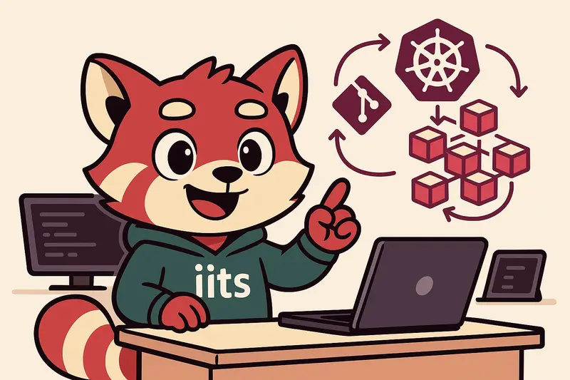

# Blueprint: T Cloud Public GitOps charts

<table>
<tr>
<td width="290" valign="top">

</td>
<td valign="top">

This is the charts side of the workshop. The cluster already exists, ArgoCD is already
running, and from here on every service is deployed by committing YAML into this
repository.

The _infrastructure-charts_ helm chart is installed by OpenTofu and follows the
[app-of-apps pattern](https://argo-cd.readthedocs.io/en/stable/operator-manual/cluster-bootstrapping/#app-of-apps-pattern):
every entry you add turns into an ArgoCD Application.

**Plan about 30 minutes**, most of it waiting for ArgoCD to sync.

</td>
</tr>
</table>

> [!IMPORTANT]
> This workshop just teaches the basics. For a proper and secure production setup
> please contact us at kontakt@iits-consulting.de

**How to read this:** part 1 is information, read it once. Part 2 is the hands on part,
one task after the other. Every task has a _Solution_ you can unfold, try it yourself
first.

## Contents

**Part 1: Information**

- [The loop: how a service gets deployed](#the-loop-how-a-service-gets-deployed)
- [How this repository is laid out](#how-this-repository-is-laid-out)
- [Where a chart can come from](#where-a-chart-can-come-from)
- [Three ways to change the values of a chart](#three-ways-to-change-the-values-of-a-chart)
- [How OpenTofu hands variables over to ArgoCD](#how-opentofu-hands-variables-over-to-argocd)
- [Later: business apps in their own repository](#later-business-apps-in-their-own-repository)

**Part 2: Tasks**

- [Task 1: open the ArgoCD UI](#task-1-open-the-argocd-ui)
- [Task 2: deploy an elastic stack](#task-2-deploy-an-elastic-stack)
- [Task 3: put Kibana on the admin dashboard](#task-3-put-kibana-on-the-admin-dashboard)
- [Task 4: scale kafka up, GitOps style](#task-4-scale-kafka-up-gitops-style)
- [Task 5, optional: your own AI on a GPU node](#task-5-optional-your-own-ai-on-a-gpu-node)

**Appendix**

- [Appendix A: running this outside the workshop](#appendix-a-running-this-outside-the-workshop)
- [Appendix B: try out the setup](#appendix-b-try-out-the-setup)

---

# Part 1: Information

## The loop: how a service gets deployed

OpenTofu installs exactly one helm chart, _infrastructure-charts_. That chart does not
deploy any workload itself, it only creates ArgoCD Applications out of the entries below
the `charts:` key in its `values.yaml`. ArgoCD then pulls each chart from wherever the
entry points to and keeps it in sync with this repository.

So the loop is always the same: edit `values.yaml`, commit, push, wait 2 to 3 minutes.

## How this repository is laid out

| Path | What it holds |
| --- | --- |
| `infrastructure-charts/values.yaml` | The list of services under `charts:`, plus the global helm registry and the parameters injected into every chart |
| `infrastructure-charts/values-dev.yaml` | Stage specific overrides, picked up through the `stage` value handed over by OpenTofu |
| `infrastructure-charts/value-files/` | A complete `values.yaml` per chart, referenced by `valueFile:` |
| `infrastructure-charts/templates/applications.yaml` | Turns every entry under `charts:` into an ArgoCD Application |
| `local-charts/` | Charts that live in this repository, for example _basic-auth_ |

> [!TIP]
> [Helm tpl](https://helm.sh/docs/howto/charts_tips_and_tricks/#using-the-tpl-function) is
> supported inside `values.yaml` and inside the files under `value-files/`, so you can
> reuse values like `{{.Values.projectValues.stageDomain}}` anywhere.

## Where a chart can come from

There are three ways to point an entry at a chart:

| Source | What you set | Deployed like this |
| --- | --- | --- |
| The global helm registry, configured under `global.helm.repoURL` (here https://charts.iits.tech/) | Nothing extra, the entry name is the chart name | _kafka_ |
| Another helm registry | Its own `repoURL` | _akhq_, and the commented out _bitnami-kafka_ |
| This git repository | Only `path`, repo and branch come from `global.git`, which OpenTofu hands over | _basic-auth_, _kumoops-admin-dashboard_ |

## Three ways to change the values of a chart

| Way | When to use it |
| --- | --- |
| Change the values inside the remote or local helm chart itself | The chart is yours |
| Set `parameters:` in `infrastructure-charts/values.yaml` | You need to template values, or you only have a few of them |
| Point `valueFile:` at a file under `value-files/` | You have a lot of static values which are not stage dependent |

Parameters look like this:

```yaml
charts:
  kafka:
    namespace: kafka
    targetRevision: 22.2.0-bitnamilegacy
    parameters:
      "kafka.replicaCount": "1"
```

A values file looks like this:

```yaml
charts:
  kumoops-admin-dashboard:
    namespace: admin
    path: "local-charts/kumoops-admin-dashboard"
    # values files needs to be inside this chart
    valueFile: "value-files/admin-dashboard/values.yaml"
```

## How OpenTofu hands variables over to ArgoCD

This is already wired up for you, the snippet only shows where the values you template
with actually come from:

```terraform
resource "helm_release" "argocd" {
  ...
  values = [
    yamlencode({
      projects = {
        infrastructure-charts = {
          projectValues = {
            # Set this to enable the stage file values-$STAGE.yaml
            stage       = var.stage
            stageDomain = var.domain_name
          }
          ...
        }
      }
    })
  ]
}
```

All `projectValues` variables are given over to ArgoCD and can be reused here, in this
example _stage_ and _stageDomain_.

## Later: business apps in their own repository

We do not split off an app repository in this workshop. This is the recipe for later, when
your business apps get their own repository and their own team:

1. Copy the whole content of this project into another git repository
2. Rename the folder _infrastructure-charts_ to something you like, for example
   _app-charts_
3. Change all the other occurrences of _infrastructure-charts_ to _app-charts_
4. Register _app-charts_ as an app-of-apps project inside OpenTofu:

   ```terraform
   resource "helm_release" "argocd" {
     ...
     values = [
       yamlencode({
         projects = {
           infrastructure-charts = {
             ...
           }
           app-charts = {
             projectValues = {
               # Set this to enable the stage file values-$STAGE.yaml
               stage     = var.stage
               appDomain = var.domain_name
             }

             git = {
               password = var.git_token
               repoUrl  = "https://my-git-repo-for-apps.git"
             }
           }
         }
       })
     ]
   }
   ```

5. ArgoCD now does the same with the _app-charts_ as with the _infrastructure-charts_

> [!NOTE]
> For each team we recommend an own git repository and AppProject. Only then you can fully
> make use of RBAC.

---

# Part 2: Tasks

Your fork and the cluster already exist, you built them with the
[otc-terraform-template](https://github.com/iits-consulting/otc-terraform-template).
If you are doing this on your own machine without that setup, start with
[Appendix A](#appendix-a-running-this-outside-the-workshop).

## Task 1: open the ArgoCD UI

ArgoCD is not exposed to the internet. Get into the UI and find the Applications that were
installed before you touched anything.

<details>
<summary>Solution</summary>

If you did not source the `shell-helper.sh` in the
https://github.com/iits-consulting/otc-terraform-template project please do so by running:

```shell
source shell-helper.sh
```

Now you are able to execute the `argo` command. It does the following:

1. Print out the username and the password on the first line
2. Open a browser tab with the ArgoCD UI. If no browser opens, use this url yourself:
   http://localhost:8080/argocd
3. Show you that ArgoCD already installed multiple charts

If all services are up and running you can also reach your admin domain like this:
`https://admin.YOUR-DOMAIN-NAME`

</details>

---

## Task 2: deploy an elastic stack

Install kibana, elasticsearch and filebeat from the global helm registry, with Kibana
served under your admin domain. The chart is called `elastic-operator`, version
`9.0.5-bitnamilegacy`, and it belongs in the `monitoring` namespace.

<details>
<summary>Solution</summary>

1. Open `infrastructure-charts/values.yaml`
2. Add a new service under the existing `charts:` key. No `repoURL` and no `path`, it comes
   from the global registry:

   ```yaml
   charts:
     # ... the entries which are already there
     elastic-operator:
       namespace: monitoring
       targetRevision: 9.0.5-bitnamilegacy
       parameters:
         ingress.kibana.host: "admin.{{.Values.projectValues.stageDomain}}"
   ```

3. Commit and push. ArgoCD detects the change and applies it after around 2 to 3 minutes

</details>

---

## Task 3: put Kibana on the admin dashboard

The dashboard should link to your new service like it does for every other one.

<details>
<summary>Solution</summary>

Edit `infrastructure-charts/value-files/admin-dashboard/values.yaml`. The chart ships one
tile per service and this repository switches off everything it does not deploy, so remove
the `kibana` entry from the disabled block, or set it to `true`:

```yaml
defaultDashboard:
  tiles:
    kibana:
      enabled: true
```

Elasticsearch itself gets no tile, it has no ingress of its own and is reached through
Kibana.

> [!WARNING]
> `enabled` has to be a real boolean. The string `"false"` is truthy in helm templates,
> so a tile written as `enabled: "false"` shows up anyway.

> [!TIP]
> If you do not want to search for icons, the full tile list is in the chart itself:
> `local-charts/kumoops-admin-dashboard/values.yaml`

</details>

---

## Task 4: scale kafka up, GitOps style

Run two kafka replicas instead of one. No `kubectl scale`, no click in the UI.

<details>
<summary>Solution</summary>

1. Change the `"kafka.replicaCount"` parameter of the _kafka_ chart in
   `infrastructure-charts/values.yaml` from 1 to 2
2. Commit and push your changes
3. Check the _kafka_ service in the ArgoCD UI and verify that it scaled up

Anything you change with `kubectl` instead gets reverted by the next sync, the repository
is the truth.

</details>

---

## Task 5, optional: your own AI on a GPU node

Run your own LLM on the cluster: Ollama on a GPU node with Open WebUI in front of it, all
of it deployed from this repository. It starts back in the terraform template, because the
GPU node pool is infrastructure.

<details>
<summary>Solution</summary>

1. Add the GPU node pool in the terraform template, see its
   [README-GPU.md](https://github.com/iits-consulting/otc-terraform-template/blob/main/README-GPU.md)
2. Come back here and work through [README-GPU.md](README-GPU.md). It is four tasks with
   solutions, turning the hand-applied manifest into a chart ArgoCD keeps in sync

</details>

> [!WARNING]
> A GPU node keeps billing. Delete the `gpu-llm` entry and the node pool when you are done.

---

# Appendix

## Appendix A: running this outside the workshop

In the workshop this is already done. If you come here without a cluster, or want to redo
the whole thing on your own account:

1. Fork this repository. ArgoCD does not pull from the iits repository, it pulls from
   _your_ copy, so the fork has to exist first
2. Set up the infrastructure according to the README within
   [this Github Template](https://github.com/iits-consulting/otc-terraform-template), with
   `TF_VAR_argocd_repo_url` pointing at your fork
3. Nothing has to be replaced inside this repository. OpenTofu hands the fork URL over to
   ArgoCD as `global.git.repoURL`, every local chart entry inherits it

---

## Appendix B: try out the setup

Now we go a little bit freestyle. Pick one of the topics below or choose one which you are
interested in. Talk with your teammates and your tutor about it first, the unfolded answer
is one possible way, not the only one.

1. **Set up an RDS database**
   - How would you create an RDS? Is there maybe a repository or website which helps you
     with that?
   - How would you initialize the database with users, tables and so on?
   - How can you avoid working with IPs? Think about having to set a private IP inside the
     microservice every time.

   <details>
   <summary>One possible answer</summary>

   - The database is infrastructure, so it belongs in OpenTofu, not in a chart. The
     [OTC provider](https://registry.terraform.io/providers/opentelekomcloud/opentelekomcloud/latest/docs)
     has `opentelekomcloud_rds_instance_v3`, and the iits terraform modules wrap it.
   - Schema and users belong to the application, not to a human. Run a migration tool
     (flyway, liquibase, an ORM migration) as a kubernetes Job or helm hook, so the same
     commit that changes the schema ships the code that needs it.
   - Do not put the IP anywhere. OpenTofu writes the RDS endpoint into `projectValues`,
     the chart templates it into the workload, and the pod talks to a name. Same trick as
     `stageDomain` in part 1.

   </details>

2. **Deploy a third party helm chart like keycloak**
   - Do you need forward-auth?
   - Do you need persistence? If yes, where do you store the data, file storage or a
     database?
   - How do you configure Keycloak, its realms and clients? No, we will not do it manually!

   <details>
   <summary>One possible answer</summary>

   - No. Keycloak _is_ the login, putting another login in front of it is a loop. It is the
     thing other services use forward-auth against.
   - Yes, and in a database, not on a file volume. Keycloak stores users, sessions and
     clients relationally, so RDS or a Postgres chart, and then it survives a pod restart
     and can run more than one replica.
   - Realms, clients and roles as code: export the realm to JSON, keep it in git, and let
     [keycloak-config-cli](https://github.com/adorsys/keycloak-config-cli) or the Keycloak
     operator apply it. Secrets stay out of the repository.

   </details>

3. **Deploy a prometheus-stack**
   - Do you need forward-auth?
   - Do you need persistence? If yes, where do you store the data, file storage or a
     database?
   - How do you configure the scrape targets, dashboards and alert rules? No, we will not
     do it manually!

   <details>
   <summary>One possible answer</summary>

   - Yes. Prometheus and Alertmanager ship no authentication at all, and everything you
     monitor is visible in there. Put forward-auth in front, or at minimum the _basic-auth_
     middleware from `local-charts/basic-auth`. Grafana can also do OIDC itself.
   - Yes, a block volume per Prometheus replica. It is a time series database, not files.
     Keep the retention short on a workshop cluster, and for real long term storage push to
     object storage with Thanos or Mimir instead of growing the disk.
   - All three are custom resources: `ServiceMonitor` and `PodMonitor` for targets,
     `PrometheusRule` for alerts, and dashboards as ConfigMaps with the
     `grafana_dashboard: "1"` label. That means they are YAML in this repository, and a
     dashboard someone clicked together in the UI is gone on the next sync.

   </details>

4. **Deploy a third party helm chart like elastic-stack**
   - Do you need forward-auth?
   - Do you need persistence? If yes, where do you store the data, file storage or a
     database?
   - How do you configure the index lifecycle and the dashboards? No, we will not do it
     manually!

   <details>
   <summary>One possible answer</summary>

   - Yes for Kibana, unless you run the licensed Elasticsearch security features. Logs
     contain more secrets than most people expect.
   - Yes, a block volume per data node. Elasticsearch owns its own storage format, so no
     shared file storage and no database. Size it for the retention you actually need.
   - Index templates and ILM policies go in as JSON through the API, applied by a Job from
     this repository, or declaratively with the ECK operator. Kibana saved objects can be
     exported to NDJSON and re-imported the same way.

   </details>

5. **Security**
   - Take a look at kyverno and think about how to add more security to your cluster
   - Which steps are needed to make third party helm images secure? Hint: take a look at
     the iits charts.

   <details>
   <summary>One possible answer</summary>

   - Kyverno is just another chart in `values.yaml`, its policies are just more YAML.
     Start in `Audit` mode with the pod security baseline, look at what would break, then
     switch the policies to `Enforce`. Useful first rules: no `:latest`, resource limits
     required, no privilege escalation, read only root filesystem.
   - For third party images: pin a digest instead of a moving tag, mirror the image into
     your own registry so an upstream deletion cannot stop your deployment, scan it (trivy)
     in CI, run it as non root with a read only filesystem and dropped capabilities, and
     add a NetworkPolicy. The iits charts set most of this by default, which is why the
     workshop pulls from https://charts.iits.tech/.

   </details>

---

## The End


[Download the clip as mp4](documentation/kumo-the-end.mp4)
